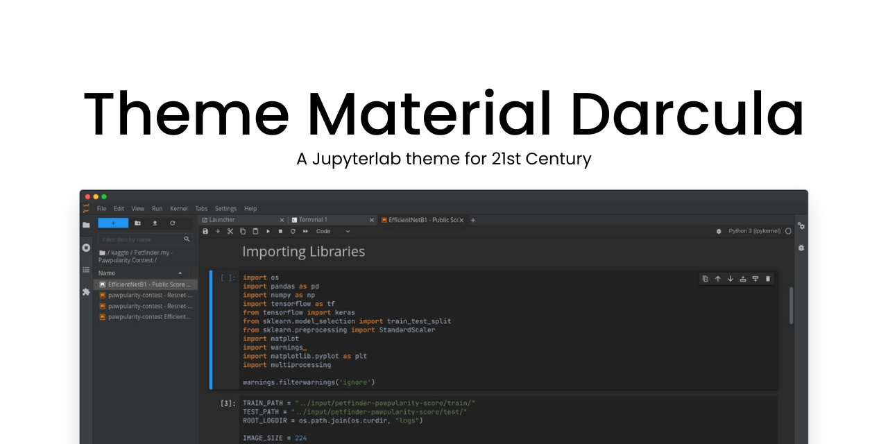

# @adhadse/theme-material-darcula


[](https://pypi.org/project/theme-material-darcula/)

<!-- [](https://www.npmjs.com/package/@adhadse/theme-material-darcula) -->

A Jupyterlab theme inspired by JetBrains IDE's Darcula scheme and Material Design. Now with support for all JupyterLab 2.x, 3.x, and 4.x versions!



## Prerequisites

- JupyterLab

## Installation

With `pip`:

```bash
pip install theme-material-darcula
```

With `conda`:

```bash
conda install -c conda-forge theme-material-darcula
```
With `mamba`:

```bash
mamba install -c conda-forge theme-material-darcula
```

**For Jupyterlab < 3**
```bash
jupyter labextension install @adhadse/theme-material-darcula
```

## Development

For a development install (requires JupyterLab 2.0.0 or later), do the following in the repository directory:

```bash
jlpm install
jlpm build:dev
```

To rebuild the package and the JupyterLab app (if using Anaconda, run from specific environment, will probably require administrator priviledges):

```bash
jlpm install
jlpm build:prod
jlpm install:extension
jupyter lab build
```

## Want to contribute?
If you find any visual inconsistency that's eye soring or anything that bugs you up. Just open a new issue and let's discuss.

To use the same environment as the binder demo (recommended):

```
conda env update -n theme-material-darcula --file binder/environment.yml # create a conda env
conda activate theme-material-darcula                                    # activate it
```

## History

A fork of [telamonian/theme-darcula](https://github.com/telamonian/theme-darcula). The original theme is still available. Somewhere during the development the theme diverged from the original one in look and feel so much that I planned to ship this as a completely different package. 

# Want to support this project? 🤔
Just give the repo a star to keep the motivation going🎉!