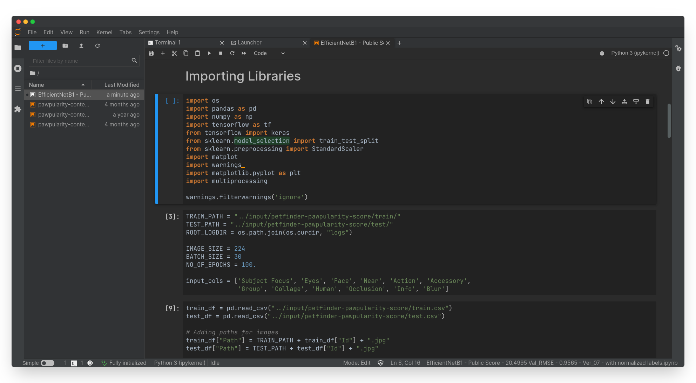
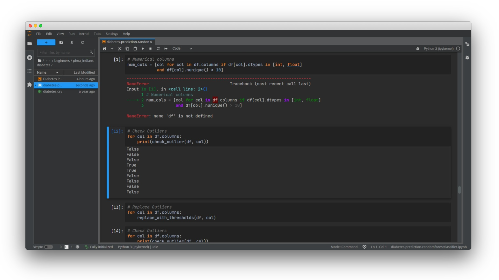
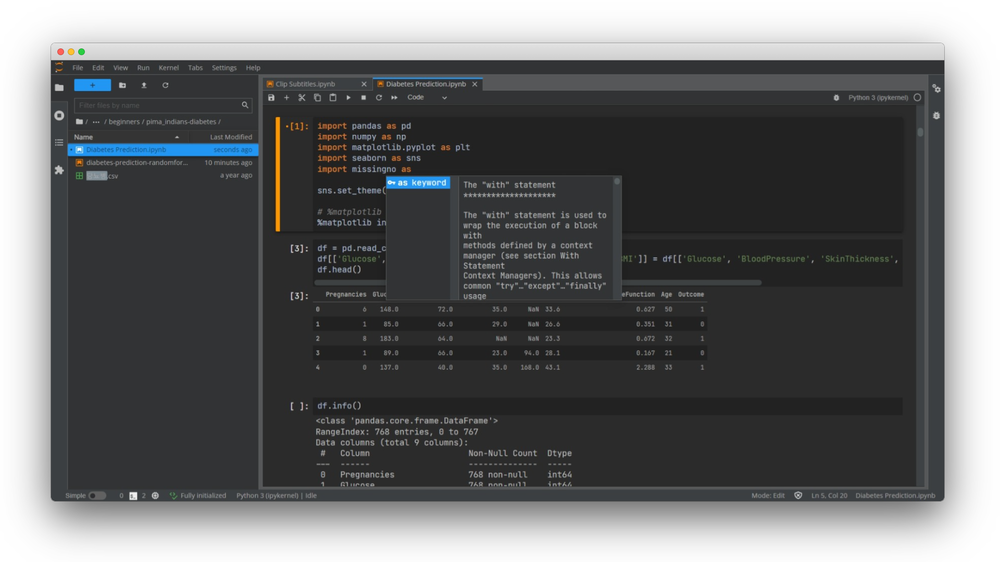

# @adhadse/theme-material-darcula

[](https://travis-ci.org/adhadse/theme-material-darcula)
[](https://pypi.org/project/theme-darcula/)
[](https://www.npmjs.com/package/@adhadse/theme-material-darcula)

A fork of [telamonian/theme-darcula](https://github.com/telamonian/theme-darcula).

Darcula theme for Jupyterlab with Material design. Modelled after the classic Intellij theme. Now with support for all JupyterLab 2.x and 3.x versions!





## Prerequisites

- JupyterLab

## Installation

With `pip`:

```bash
pip install theme-material-darcula
```

With `mamba`:

```bash
mamba install -c conda-forge theme-material-darcula
```

With `conda`:

```bash
conda install -c conda-forge theme-material-darcula
```

**For Jupyterlab < 3**
```bash
jupyter labextension install @adhadse/theme-material-darcula
```

## Dark scrollbars

Enable dark scrollbars by clicking on **Settings** -> **JupyterLab Theme** -> **Theme Scrollbars** in the JupyterLab menus.

## Development

For a development install (requires JupyterLab 2.0.0 or later), do the following in the repository directory:

```bash
jlpm build:dev
```

To rebuild the package and the JupyterLab app (if using Anaconda, run from specific environment, will probably require administrator priviledges):

```bash
jlpm build:prod
jlpm install:extension
jupyter lab build
```

## History

This was the first JupyterLab theme that included dark scrollbars. As of JupyterLab 1.0, the dark scrollbars feature from this theme was incorporated into JupyterLab core, as part of [@jupyterlab/application/style/scrollbar.css](https://github.com/jupyterlab/jupyterlab/blob/6d5240dda71fb3d12814e8b88b09e94e23d42875/packages/application/style/scrollbar.css).

JupyterLab itself now supports dark scrollbars for dark themes in Chrome, Firefox, and Safari. See [here](https://developer.mozilla.org/en-US/docs/Web/CSS/::-webkit-scrollbar) and [here](https://developer.mozilla.org/en-US/docs/Web/CSS/CSS_Scrollbars) for more info on how this is done.
